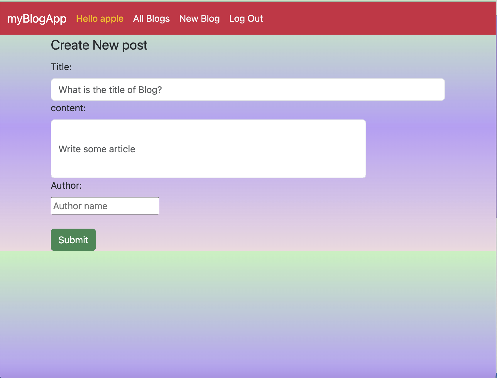
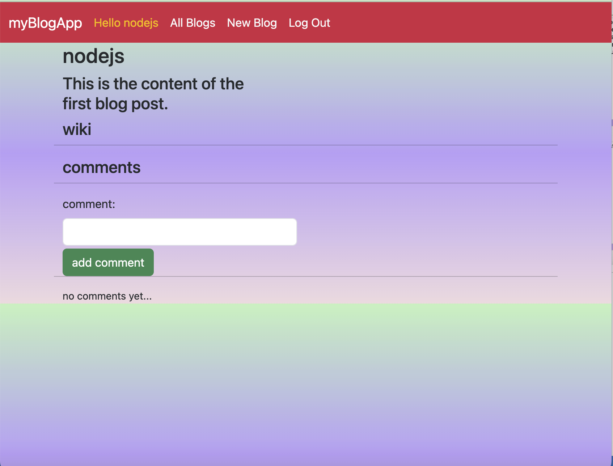
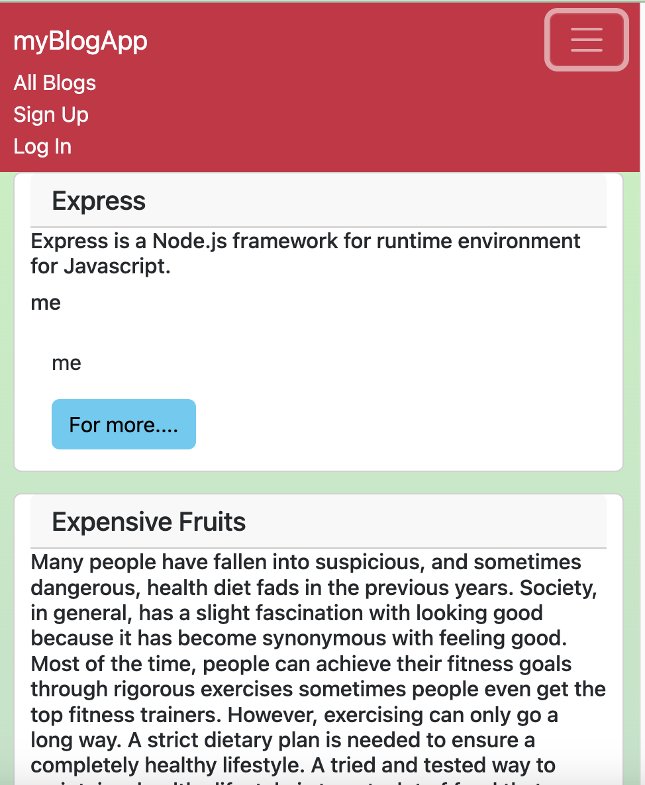

#My Blog App 

This blog app is my second project. 

Inspired to write this project as I didnt find the any blog posts that covers varieties of topics. Yet there are many bloggers and blog pages but thery are not visually attractive.

<h4>TechnologiesIncluded </h4>
<ol>
<li>HTML</li>
<li>CSS</li>
<li>Javascript</li>
<li>Bootstrap</li>
<li>Liquidjs</li>
<li>Nodejs</li>
<li>Express</li>
<li>MongoDB</li>
<li>Mongoose</li>
</ol>

<h4>As a user I want the ability to </h4>

<ul>
<li>SigninL</li>
<li>SignUP</li>
<li>Create Blog Posts</li>
<li>Comment</li>
<li>Delete Comments</li>
<li>Edit Posts</li>
</ul>

ERD

