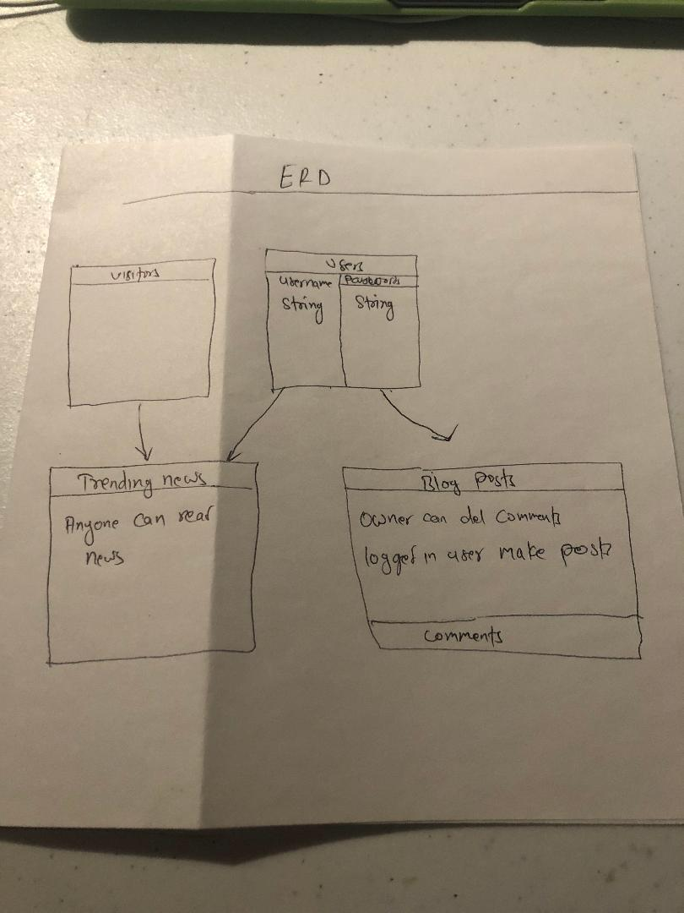

# mynewsblog

This webapp is about the  blog where there are trending news and also the blogposts. The user are able to view the trending news and also make comments. The webapp also allows user to create account and make a blog post of their interest. I am motivated to make this post as I did not find the  single reliable source of news.

<h3> Technologies Included<h3/>

<ul>
<li>HTML></li>
<li>CSS></li>
<li>Javascript</li>
<li>Node.js</li>
<li>Express</li>
<li>mongoose</li>
<li>Express</li>
<li>Liquidjs</li>

<h4>
As a user I want the Ability to </h4>

1.signup 
2.signin 
3.Read the Trending News 
4.Make a blog Post                       
5.Make Comments  
6.change passwords

.jpeg)

.jpeg)

.jpeg)

.jpeg)
 
<h4>Entity Relationship Diagram</h4>

The Diagram below shows the relationships bteween the user and visitors with the actual web App. Users are authorized to make posts and comments.Post owner can delete the comments as well. Anybody has the ability to read the trending news.

